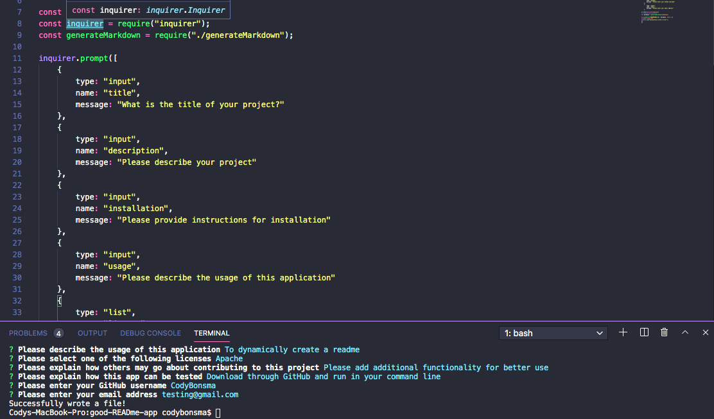

# good-READme-app

## Description
A command-line application that can be used to dynamically generate a readme file through node.js 

## Screenshots
generate markdown file

index.js file

## Technology used
- JavaScript
- Node.js
- inquirer module
- Screencastify
